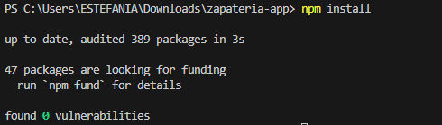
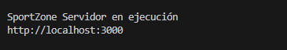

# Instrucciones de instalación Y configuración

## Objetivo
Instalar todas las dependencias del proyecto, ejecutar el servidor en modo desarrollo y verificar que el sistema funcione correctamente en el puerto 3000.

## Paso 1: Instalación de Dependencias

### Comando
Ubicarse en la carpeta del proyecto y ejecutar:
npm install

### Salida Esperada

## Paso 2: Ejecutar el Servidor en Modo Desarrollo

### Comando
npm run dev

### Salida Esperada

## Paso 3: Verificar Funcionamiento en Puerto 3000

### Verificar en Navegador
Abrir navegador y visitar: http://localhost:3000

### Resultado esperado

